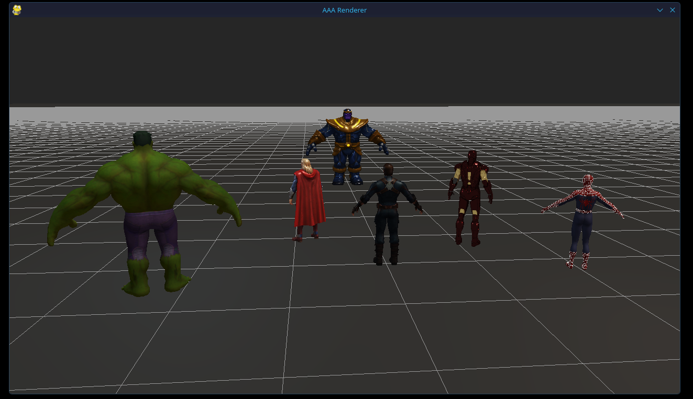
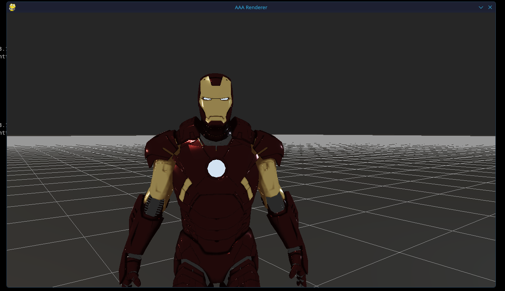
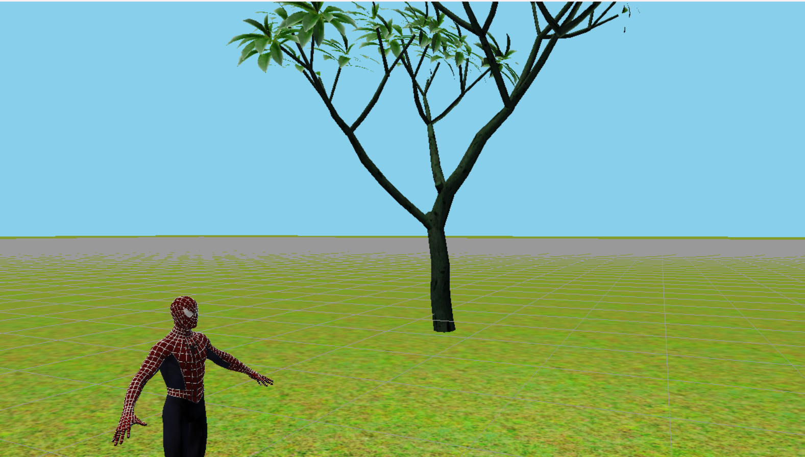
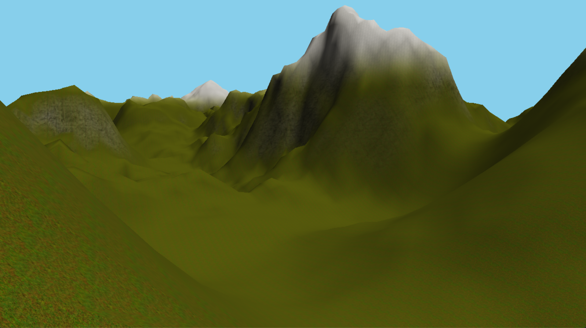

# 3D Render Engine

A modern **3D rendering engine built from scratch** using **Python, ModernGL, and Pygame**.  
Designed with a modular architecture, real-time lighting, PBR materials, and shadow mapping.

---

## 📸 Screenshots

### 🧱 Scene Overview

### 🎮 Player Controller

### ⛰️ Terrain

---

## 🚀 Features

### 🎨 Rendering
- Physically Based Rendering (PBR)
- Cook-Torrance BRDF
- Normal Mapping
- Metallic / Roughness workflow
- Emissive materials
- Ambient Occlusion support

### 💡 Lighting System
- Directional Light (Sun)
- Point Lights
- Multiple lights (up to 8)
- Real-time lighting calculations

### 🌑 Shadows
- Shadow Mapping
- PCF (soft shadows)
- Bias correction to reduce artifacts

### 🧱 Models & Geometry
- GLB / GLTF loader (custom implementation)
- Node-based transform hierarchy
- Multiple mesh instances
- Built-in primitives:
  - Cube
  - Plane
  - Grid

### 🚀 Physics
- AABB Collision Detection
- Smooth Gravity
- Penentration

### 🎮 Player Controller
- WASD + Mouse Movement and Camera
- First Person Controller
- Smooth Jumping Physics
- Sprinting
- PS Controller Support

### 🎥 Camera System
- WASD movement
- Mouse look
- Gamepad support (experimental)
- Smooth movement handling

### ⛰️ Terrain
- Heightmap to mesh
- Textures
- Auto terrain painter

## How to view terrain?
- Go to scene.py, change terrain_toggle to True
- Go to player.py, in __init__ change self.orbit_mode to True
- To go back to normal, just change both of them back to False

### ⚙️ Engine Architecture
- Modular render pipeline:
  - Shadow Pass
  - Forward Pass
  - Grid Pass
- Scene system abstraction
- Object-oriented design
- Config-based setup

---

## 🧠 Tech Stack

- Python
- ModernGL (OpenGL 3.3)
- Pygame
- NumPy
- Pyrr (math)
- Pillow (textures)
- gltflib (GLB parsing)

---

## ⚡ Getting Started

### 1. Clone the repository
git clone https://github.com/zolox11/3d-render-engine.git
cd 3d-render-engine

### 2. Create a virtual environment
python -m venv venv

### 3. Activate it

Windows:
venv\Scripts\activate

Linux / macOS:
source venv/bin/activate

### 4. Install dependencies
pip install -r requirements.txt

### 5. Run the engine
python main.py

---

## 🎮 Controls

| Input        | Action        |
|--------------|--------------|
| W / A / S / D / Q / E | Move camera |
| Mouse                 | Look around |
| ESC/ESCAPE                  | Exit        |

---

## 🧩 Rendering Pipeline

Start Frame  
↓  
Shadow Pass  
↓  
Forward Rendering  
↓  
Grid Overlay  
↓  
Display Output  

---

## 🔥 Highlights

- Fully custom GLB loader
- Node-based hierarchy support
- PBR material system
- Real-time lighting & shadows
- Modular architecture

---

## 📈 Future Improvements

- Skeletal animation
- Scene editor
- Post-processing (bloom, SSAO)
- Instancing system

---

## ⚠️ Known Issues

- Some GLB models need manual tweaking
- Gamepad support is limited
- No skeletal animation yet

---

## ⭐ Support

If you like this project, give it a star ⭐
